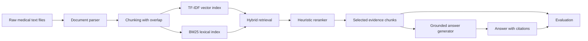

# Med-RAG Portfolio Demo

This is a small, runnable Medical RAG demo. It abstracts the core ideas from a fuller Med-RAG project into a compact repo that can run locally on a tiny raw-text corpus.

The goal is not to maximize model performance. The goal is to show that the system covers the full RAG lifecycle and that each module has an explicit design trade-off.

## Capability Checklist

- Document parsing: loads raw `.txt` medical notes with metadata headers.
- Chunking: word-window chunking with overlap and stable `doc_id::cN` chunk IDs.
- Embedding: lightweight local TF-IDF vectors for semantic retrieval.
- Vector retrieval: cosine similarity over embedded chunks.
- BM25 retrieval: lexical retrieval for exact medical terms and abbreviations.
- Hybrid retrieval: reciprocal rank fusion combines vector and BM25 results.
- Reranking: combines retrieval score, query-term coverage, and recency.
- Answer generation: grounded answer generator cites selected chunks.
- Hallucination mitigation: answer is constrained to retrieved context and reports insufficient evidence.
- Evaluation: retrieval proxy metrics, citation coverage, structure checks, source diversity, and latency.

## Architecture



## Repository Map

```text
demo/
├── data/sample_documents/     # Small raw-text medical corpus
├── src/
│   ├── document_loader.py     # Raw document parsing
│   ├── chunking.py            # Chunk and scored-hit data structures
│   ├── embeddings.py          # Dependency-free TF-IDF embedder
│   ├── bm25_retriever.py      # Lexical retrieval
│   ├── vector_retriever.py    # Semantic retrieval
│   ├── hybrid_retriever.py    # Reciprocal rank fusion
│   ├── reranker.py            # Lightweight reranking
│   ├── generator.py           # Template/Ollama grounded generator
│   ├── qa_pipeline.py         # End-to-end pipeline
│   └── evaluation.py          # Retrieval and generation evaluation
├── examples/run_demo.py       # One-command demo runner
├── docs/design_notes.md       # Design decisions and trade-offs
└── outputs/                   # Demo outputs
```

## Quick Start

No external Python packages are required for the default demo.

```bash
cd demo
python examples/run_demo.py
```

Try a custom query:

```bash
python examples/run_demo.py \
  --query "What lifestyle changes help prevent type 2 diabetes?"
```

Use a local Ollama model instead of the deterministic template generator:

```bash
python examples/run_demo.py \
  --query "How should asthma control be managed?" \
  --generator_backend ollama \
  --generator_model deepseek-r1:7b
```

The result is written to:

```text
outputs/demo_result.json
```

## Example Output Shape

```json
{
  "query": "How can type 2 diabetes be prevented?",
  "answer": "## Answer ... [diabetes_prevention::c0]",
  "sources": [
    {
      "chunk_id": "diabetes_prevention::c0",
      "title": "Lifestyle prevention of type 2 diabetes",
      "score": 0.91
    }
  ],
  "evaluation": {
    "generation": {
      "citation_coverage": {"coverage": 1.0, "passed": true},
      "structure": {"passed": true}
    },
    "retrieval_proxy": {
      "pass_at_1": 0.8,
      "pass_at_3": 1.0,
      "mrr": 0.9
    }
  },
  "metrics": {
    "num_documents": 3,
    "num_chunks": 6,
    "timings_seconds": {"retrieval": 0.001, "generation": 0.0}
  }
}
```

## Evaluation Without Gold Labels

This demo assumes we only have raw text data and no manually labeled query-answer pairs. The evaluation is therefore proxy-based:

- Retrieval proxy evaluation: self-similarity and inverse-cloze style checks ask whether a chunk can retrieve itself or its source document.
- Citation coverage: every citation in the answer must refer to a selected retrieved chunk.
- Structure check: the answer must contain Answer, Evidence, and Limitations/Safety sections.
- Source diversity: tracks whether the answer relies on multiple source documents or only one.
- Operational metrics: records latency, chunk count, answer length, and selected source count.

These metrics do not replace human evaluation, but they give a practical regression signal for a raw-text RAG prototype.

## Design Decisions

- TF-IDF embedding instead of BGE/OpenAI: keeps the portfolio demo dependency-free and runnable anywhere. In production, replace `TfidfEmbedder` with BGE, OpenAI embeddings, or a vector database.
- BM25 + vector retrieval: BM25 catches exact medical terms; vector retrieval handles semantic overlap. RRF makes the system robust without requiring score calibration.
- Lightweight reranker: combines retrieval score, query-term coverage, and recency to expose ranking trade-offs. In production, replace with a cross-encoder reranker.
- Grounded generator: defaults to an extractive/template answer so that hallucination mitigation is visible and the demo works without a running LLM.
- Optional Ollama backend: demonstrates local LLM integration while preserving a deterministic default path.

## Production Extensions

- Replace in-memory retrieval with Chroma or another vector store.
- Replace TF-IDF vectors with BGE or domain-specific biomedical embeddings.
- Replace heuristic reranking with `BAAI/bge-reranker-base` or another cross-encoder.
- Add structured LLM judge or RAGAS-style metrics when a stronger evaluator is available.
- Add manually labeled query-document pairs for Recall@k, MRR, and NDCG.

## Medical Safety Note

This is a technical RAG demo. The generated answers are grounded in tiny sample documents and are not medical advice.

